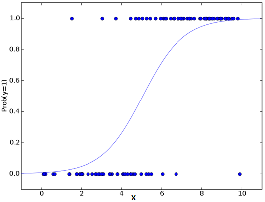

# autoML 
##### Information technology study about machine learning using the libray scikit-learn for the Python programming language and their related concepts. 

First, we need to know that machine learning is the field of study that gives computers the ability to learn without being explicitly programmed, this is a denifition 
described by Arthur Samuel, an American pioneer in the field of computer gaming and artificial intelligence and the coined the term **"Machine Learning"** in 1959 while at 
IBM. Tom Mitchell provides a more modern definition: "A computer program is said to learn from **experience E** with respect to some class of **tasks T** and **performance measure P**,
if its performance at tasks in T, as measured by P, improves with experience E. So, int machine learning there are two types of algorithms to solve problems of data 
analytics: the **supervised Learning** and the **unsupervised learning**. Finally, in learning data science with Python, generally, we use the **scikit-learn**, a open source Python
library that implements a wide variety of machine learning,  preprocessing, cross-validation and visualization algorithms with the help of a unified interface. Depending
on the input data, we will use different methods implemented in the the library, as shown in the image below:
<p align="center">  </p>

## Loading The Data

In Scikit, your data needs to be numeric and stored as NumPy arrays or SciPy sparse matrices. Other types that are convertible to numeric arrays, such as Pandas DataFrame, are also acceptable.

## Training and Test Data

Machine learning is about learning some properties of a data set and applying them to new data. This is why a common practice in machine learning to evaluate an algorithm is to split the data 
at hand into two sets, one that we call the **training set** on which we learn data properties and one that we call the **testing set** on which we test these properties. So, we gonna to do this:  
```python
#Import Library
from sklearn.model_selection import train_test_split
#Split model
X_train, X_test, y_train, y_test = train_test_split(X, y, test_size=0.33, random_state=42)
```
This function will split arrays or matrices into random train and test subsets. For more detail on this, please refer this [link](http://scikit-learn.org/stable/modules/generated/sklearn.model_selection.train_test_split.html).

## Preprocessing The Data

In Scikit, we use the sklearn.preprocessing package, that provides several common utility functions and transformer classes to change raw feature vectors into a representation that is more 
suitable for the downstream estimators. In general, learning algorithms benefit from standardization of the data set. If some outliers are present in the set, robust scalers or transformers 
are more appropriate. 

### Rescale

When your data is comprised of attributes with varying scales, many machine learning algorithms can benefit from rescaling the attributes to all have the same scale. Often this is referred to as
normalization and attributes are often rescaled into the range between 0 and 1. This is useful for optimization algorithms in used in the core of machine learning algorithms like gradient descent.
It is also useful for algorithms that weight inputs like regression and neural networks and algorithms that use distance measures like K-Nearest Neighbors. So, we gonna do this to rescale the data:

```python
#Import Library
from sklearn.preprocessing import MinMaxScaler
#Preprocessing data
scaler = MinMaxScaler(feature_range=(0, 1))
rescaledX = scaler.fit_transform(X)
```
For more detail on this, please refer  this [link](http://scikit-learn.org/stable/modules/generated/sklearn.preprocessing.MinMaxScaler.html).

### Standardization

Standardization is a useful technique to transform attributes with a Gaussian distribution and differing means and standard deviations to a standard Gaussian distribution with a mean of 0 and a
standard deviation of 1. It is most suitable for techniques that assume a Gaussian distribution in the input variables and work better with rescaled data, such as linear regression, logistic 
regression and linear discriminate analysis. So, we gonna do this to standardize the data:

```python
#Import Library
from sklearn.preprocessing import StandardScaler
#Preprocessing data
scaler = StandardScaler().fit(X)
rescaledX = scaler.transform(X)
```
For more detail on this, please refer  this [link](http://scikit-learn.org/stable/modules/generated/sklearn.preprocessing.StandardScaler.html#sklearn.preprocessing.StandardScaler).

### Normalization

Normalizing in scikit-learn refers to rescaling each observation (row) to have a length of 1 (called a unit norm in linear algebra). This preprocessing can be useful for sparse datasets
(lots of zeros) with attributes of varying scales when using algorithms that weight input values such as neural networks and algorithms that use distance measures such as K-Nearest Neighbors
. So, we gonna do this to normalize the data:

```python
#Import Library
from sklearn.preprocessing import Normalizer
#Preprocessing data
scaler = Normalizer().fit(X)
normalizedX = scaler.transform(X)
```
For more detail on this, please refer  this [link](http://scikit-learn.org/stable/modules/generated/sklearn.preprocessing.Normalizer.html#sklearn.preprocessing.Normalizer).

### Binarization 

You can transform your data using a binary threshold. All values above the threshold are marked 1 and all equal to or below are marked as 0. This is called binarizing your data or threshold 
your data. It can be useful when you have probabilities that you want to make crisp values. It is also useful when feature engineering and you want to add new features that indicate something
meaningful. So, we gonna do this to binarize the data:

```python
#Import Library
from sklearn.preprocessing import Binarizer
#Preprocessing data
binarizer = Binarizer(threshold=0.0).fit(X)
binaryX = binarizer.transform(X)
```
For more detail on this, please refer  this [link](http://scikit-learn.org/stable/modules/generated/sklearn.preprocessing.Binarizer.html#sklearn.preprocessing.Binarizer).

### Enconding Categorical Features

You can encode your data labels with value between 0 and n_classes-1. So we used to normalize labels and transform non-numerical labels (as long as they are hashable and comparable) to numerical
labels. So, we gonna do this to encode the data:

```python
#Import Library
from sklearn.preprocessing import LabelEncoder
#Preprocessing data
enc = LabelEncoder()
y = enc.fit_transformer(y)
```
For more detail on this, please refer  this [link](http://scikit-learn.org/stable/modules/generated/sklearn.preprocessing.LabelEncoder.html#sklearn.preprocessing.LabelEncoder).

### Input Missing Values

If your data has missing values, you can use Imputer transformer for completing missing values. The Imputer class provides basic strategies for imputing missing values, either using the mean,
the median or the most frequent value of the row or column in which the missing values are located. This class also allows for different missing values encodings.  So, we gonna do this to complete
the data:

```python
#Import Library
from sklearn.preprocessing import Imputer
#Preprocessing data
imp = Imputer(missing_values=0, strategy='mean', axis=0)
imp.fit_transformer(X_train)
```
For more detail on this, please refer  this [link](http://scikit-learn.org/stable/modules/generated/sklearn.preprocessing.Imputer.html#sklearn.preprocessing.Imputer).

### Generating Polynomial Features

If your want to generate polynomial and interaction features, you can use PolynomialFeatures to generate a new feature matrix consisting of all polynomial combinations of the features with 
degree less than or equal to the specified degree. For example, if an input sample is two dimensional and of the form [a, b], the degree-2 polynomial features are [1, a, b, a^2, ab, b^2].  
So, we gonna do this to generate the data:

```python
#Import Library
from sklearn.preprocessing import PolynomialFeatures
#Preprocessing data
poly = PolynomialFeatures(5)
poly.fit_transformer(X)
```
For more detail on this, please refer  this [link](http://scikit-learn.org/stable/modules/generated/sklearn.preprocessing.PolynomialFeatures.html#sklearn.preprocessing.PolynomialFeatures).

## Create Your Model

Now that we have separated the data into test and training sets, we can begin to choose a classifier algorithm. 

### Supervised Learning 

In supervised learning, we are given a data set and already know what our correct output should look like, having the idea that there is a relationship between the input and the output.
Supervised learning problems are categorized into "regression" and "classification" problems. In a regression problem, we are trying to predict results within a **continuous output**, 
meaning that we are trying to map input variables to some continuous function. In a classification problem, we are instead trying to predict results in a discrete output. In other words,
we are trying to map input variables into discrete categories. Examples of supervised learning are: Regression, Decision Tree, Random Forest, KNN, Logistic Regression, etc.

#### Linear Regression

Linear regression attempts to model the relationship between two variables by **fitting** a linear equation to **observed** data. One variable is considered to be an 
explanatory variable, and the other is considered to be a dependent variable.  Before attempting to fit a linear model to observed data, a modeler should first
determine whether or not there is a relationship between the variables of interest. This does not necessarily imply that one variable causes the other, but that
there is some significant association between the two variables. 
A linear regression line has an equation of the form **Y = a + bX**, where X is the **explanatory** variable and Y is the **dependent** variable. The slope of the line is
b, and a is the intercept (the value of y when x = 0). See the example below. Here we have identified the best fit line having the linear equation y = 0.2811x + 13.9.
Now, using this equation, we can find the weight, knowing the height of a person.
<p align="center">  </p>
Finally, linear regressions can be two types: Simple Linear Regression and Multiple Linear Regression. Simple Linear Regression is characterized by an 
independent variable and multiple linear regression is characterized by multiple independent variables and by looking for the best fit line. So below there is a python code with an example using linear regression:

```python
#Import Library
#Import other necessary libraries like pandas, numpy...
from sklearn import linear_model
#Load Train and Test datasets
#Identify feature and response variable(s) and values must be numeric and numpy arrays
x_train=input_variables_values_training_datasets
y_train=target_variables_values_training_datasets
x_test=input_variables_values_test_datasets
# Create linear regression object
linear = linear_model.LinearRegression()
# Train the model using the training sets and check score
linear.fit(x_train, y_train)
linear.score(x_train, y_train)
#Equation coefficient and Intercept
print('Coefficient: \n', linear.coef_)
print('Intercept: \n', linear.intercept_)
#Predict Output
predicted= linear.predict(x_test)
```
For more detail on this, please refer  this [link](http://scikit-learn.org/stable/modules/linear_model.html).

#### Logistic Regression

It is used to estimate **discrete values** (binary values as 0/1, yes / no, true / false) based on a group of independent variables. In simple words, it predicts the 
probability of an event occurring, adjusting the data to a logistic function. Therefore, it is also known as logistic regression. As predicted by the probability, 
its output values are something expected between 0 and 1. It is useful for modeling the probability of an **event occurring as a function of other factors**. 
So, the chances of the result are modeled as a linear combination of the forecast variables.

**(p / (1-p)) logit (p) = ln (p / (1-p)) probability of occurrence / probability of occurrence ln (odds) = ln = b0 + b1X1 + b2X2 + b3X3 .... + bkXk**

Above, p is the probability of the presence of the characteristic of interest. It chooses the parameters that **maximize the probability** of observing sample values
rather than **minimizing the sum of error square** (as in simple regression). Now, using this equation, we can plot the results in graphic below:
<p align="center">  </p>
So below there is a python code with an example using logistic regression:

```python
#Import Library
from sklearn.linear_model import LogisticRegression
#Assumed you have, X (predictor) and Y (target) for training data set and x_test(predictor) of test_dataset
# Create logistic regression object
model = LogisticRegression()
# Train the model using the training sets and check score
model.fit(X, y)
model.score(X, y)
#Equation coefficient and Intercept
print('Coefficient: \n', model.coef_)
print('Intercept: \n', model.intercept_)
#Predict Output
predicted= model.predict(x_test)
```
For more detail on this, please refer  this [link](http://scikit-learn.org/stable/modules/linear_model.html#logistic-regression).

#### Decision Tree

It is a type of supervised learning algorithm most commonly used for classification problems. Surprisingly, it works for both categorical and continuous dependent
variables. In these algorithms we divide the population into two or more homogeneous groups. This is done based on the most significant independent attributes or 
variables to make the groups as distinct as possible.
<p align="center">  </p>
In the image above, it can be seen that the population is classified into two different groups based on multiple attributes, to identify if they will PLAY or not.
To divide the population into different and heterogeneous groups, several techniques are used, such as Gini, Information Gain, Chi-Square and entropy.
So below there is a python code with an example using decision tree:
```python
#Import Library
#Import other necessary libraries like pandas, numpy...
from sklearn import tree
#Assumed you have, X (predictor) and Y (target) for training data set and x_test(predictor) of test_dataset
# Create tree object 
model = tree.DecisionTreeClassifier(criterion='gini') # for classification, here you can change the algorithm as gini or entropy (information gain) by default it is gini  
# model = tree.DecisionTreeRegressor() for regression
# Train the model using the training sets and check score
model.fit(X, y)
model.score(X, y)
#Predict Output
predicted= model.predict(x_test)
```
For more detail on this, please refer  this [link](http://scikit-learn.org/stable/modules/tree.html).
#### SVM

It is a method of classification. In this algorithm, each data is plotted as a point in an n-dimensional space (where n is the number of characteristics that one has)
with the value of each characteristic being the value of a particular coordinate, these coordinates are called Support Vectors.
<p align="center">  </p>
Now let's find a line that divides the data into two different groups of classified data. The line will be at the nearest point where the distances of each point in the
two groups will be as large as possible.
<p align="center">  </p>
In the example above, the line dividing the data into two sorted groups is the black line, because the two closest points are the farthest, off the line. This is our classifier.
So, depending on which side of the line test data is placed, this will be the class in which the new data can be sorted.
So below there is a python code with an example using decision svm:
```python
#Import Library
from sklearn import svm
#Assumed you have, X (predictor) and Y (target) for training data set and x_test(predictor) of test_dataset
# Create SVM classification object 
model = svm.svc() # there is various option associated with it, this is simple for classification. You can refer link, for mo# re detail.
# Train the model using the training sets and check score
model.fit(X, y)
model.score(X, y)
#Predict Output
predicted= model.predict(x_test)
```
For more detail on this, please refer  this [link](http://scikit-learn.org/stable/modules/svm.html).
#### Naive Bayes

It is a classification technique based on the Bayes' theorem that assumes the independence between predictors. In simple terms, a classifier in Naive Bayes assumes
that the presence of a particular characteristic in a class is not related to the presence of any other characteristic. This algorithm is mainly used in classifying
text and with problems that have multiple classes.
So below there is a python code with an example using decision naive bayes:
```python
#Import Library
from sklearn.naive_bayes import GaussianNB
#Assumed you have, X (predictor) and Y (target) for training data set and x_test(predictor) of test_dataset
# Create SVM classification object model = GaussianNB() # there is other distribution for multinomial classes like Bernoulli Naive Bayes, Refer link
# Train the model using the training sets and check score
model.fit(X, y)
#Predict Output
predicted= model.predict(x_test)
```
For more detail on this, please refer  this [link](http://scikit-learn.org/stable/modules/naive_bayes.html).
#### KNN
Can be used for both classification and regression problems. However, it is more widely used in classification problems in the industry. K nearest neighbors is a simple algorithm that stores all available cases and classifies new cases by majority vote of their neighbors k. The case that is being assigned to the class is most common among its nearest K neighbors as measured by a distance function.

These distance functions can be Euclidian, Manhattan, Minkowski and Hamming distance. The first three functions are used for the continuous function and the fourth 
(Hamming) for categorical variables. If K = 1, then the case is simply assigned to the class of its nearest neighbor. Sometimes choosing the K turns out to become a 
challenge while running KNN modeling.
<p align="center">  </p>
So below there is a python code with an example using decision knn:
```python
#Import Library
from sklearn.neighbors import KNeighborsClassifier
#Assumed you have, X (predictor) and Y (target) for training data set and x_test(predictor) of test_dataset
# Create KNeighbors classifier object model 
KNeighborsClassifier(n_neighbors=6) # default value for n_neighbors is 5
# Train the model using the training sets and check score
model.fit(X, y)
#Predict Output
predicted= model.predict(x_test)
```
For more detail on this, please refer  this [link](http://scikit-learn.org/stable/modules/neighbors.html).
###### Random Forest

Random forest is a trademarked term for a set of decision trees. In Random Forest, we have a collection of decision trees (so-called "Forest"). To sort a new object 
based on attributes, each tree gives a rating and we say the tree "vote" for that class. The forest chooses the rank that has the most votes (most of all trees in the 
forest).
Each tree is planted and cultivated as follows:

1. If the number of cases in the training set is N, then sample n cases is taken at random, but with replacement. This sample will be the training set for tree cultivation.
2. If there are M input variables, a number m << M is specified such that at each node, the m variables are randomly selected out of M and the best division on these m is used to divide the node. The value of m is kept constant during forest growth.
3. Each tree is grown to the greatest extent possible. There is no pruning.

So below there is a python code with an example using decision random forest:
```python
#Import Library
from sklearn.ensemble import RandomForestClassifier
#Assumed you have, X (predictor) and Y (target) for training data set and x_test(predictor) of test_dataset
# Create Random Forest object
model= RandomForestClassifier()
# Train the model using the training sets and check score
model.fit(X, y)
#Predict Output
predicted= model.predict(x_test)
```
For more detail on this, please refer  this [link](http://scikit-learn.org/stable/modules/ensemble.html).

#### Gradient Boost and Adaboost

GBM & AdaBoost are driving algorithms used when dealing with a large amount of data to make a forecast with high power. Reinforcement is a joint learning algorithm
that combines the prediction of several base estimators to improve robustness over a single estimator. It combines several weak or medium predictors to a strong 
predictor of construction. These algorithms always work well in data science competitions, such as Kaggle, AV Hackathon, CrowdAnalytix.
So below there is a python code with an example using decision gradient boost and adaboost:
```python
#Import Library
from sklearn.ensemble import GradientBoostingClassifier
#Assumed you have, X (predictor) and Y (target) for training data set and x_test(predictor) of test_dataset
# Create Gradient Boosting Classifier object
model= GradientBoostingClassifier(n_estimators=100, learning_rate=1.0, max_depth=1, random_state=0)
# Train the model using the training sets and check score
model.fit(X, y)
#Predict Output
predicted= model.predict(x_test)
```
For more detail on this, please refer  this [link](http://scikit-learn.org/stable/modules/ensemble.html).

#### Neural Network

Neural Networks are a machine learning framework that attempts to mimic the learning pattern of natural biological neural networks: you can think of them as a crude
approximation of what we assume the human mind is doing when it is learning. Biological neural networks have interconnected neurons with dendrites that receive inputs,
then based on these inputs they produce an output signal through an axon to another neuron. We will try to mimic this process through the use of Artificial Neural 
Networks (ANN), which we will just refer to as neural networks from now on. Neural networks are the foundation of deep learning, a subset of machine learning that is 
responsible for some of the most exciting technological advances today! The process of creating a neural network in Python begins with the most basic form, a single 
perceptron. A perceptron has one or more inputs, a bias, an activation function, and a single output. The perceptron receives inputs, multiplies them by some weight, 
and then passes them into an activation function to produce an output. There are many possible activation functions to choose from, such as the logistic function, a 
trigonometric function, a step function etc. We must also make sure to add a bias to the perceptron, a constant weight outside of the inputs that allows us to achieve
better fit for our predictive models. Check out the diagram below for a visualization of a perceptron:
<p align="center">  </p>
Once we have the output we can compare it to a known label and adjust the weights accordingly (the weights usually start off with random initialization values). We keep
repeating this process until we have reached a maximum number of allowed iterations, or an acceptable error rate. To create a neural network, we simply begin to add 
layers of perceptrons together, creating a multi-layer perceptron model of a neural network. You’ll have an input layer which directly takes in your data and an output
layer which will create the resulting outputs. Any layers in between are known as hidden layers because they don’t directly “see” the feature inputs within the data 
you feed in or the outputs. For a visualization of this check out the diagram below.
<p align="center">  </p>
So below there is a python code with an example using decision neural network:
```python
#Import Library
from sklearn.model_selection import train_test_split
#Split in test and train
X_train, X_test, y_train, y_test = train_test_split(X, y)
from sklearn.preprocessing import StandardScaler
scaler = StandardScaler()
# Fit only to the training data
scaler.fit(X_train)
StandardScaler(copy=True, with_mean=True, with_std=True)
# Now apply the transformations to the data:
X_train = scaler.transform(X_train)
X_test = scaler.transform(X_test)
from sklearn.neural_network import MLPClassifier
# Create an instance of the model. For this parameter you pass in a tuple consisting of the number of neurons you want at each layer, 
# where the nth entry in the tuple represents the number of neurons in the nth layer of the MLP model. We will choose 3 layers with the same
# number of neurons as there are features in our data set along with 500 max iterations.
mlp = MLPClassifier(hidden_layer_sizes=(13,13,13),max_iter=500)
mlp.fit(X_train,y_train)
predictions = mlp.predict(X_test)
# Built in metrics such as a classification report and confusion matrix to evaluate how well our model performed
from sklearn.metrics import classification_report,confusion_matrix
print(confusion_matrix(y_test,predictions))
print(classification_report(y_test,predictions))
```
For more detail on this, please refer  this [link](http://scikit-learn.org/stable/modules/neural_networks_supervised.html).

### Unsupervised Learning

Unsupervised learning allows us to approach problems with little or no idea what our results should look like. 
We can derive structure from data where we don't necessarily know the effect of the variables. We can derive this structure by clustering the data based on relationships among the variables in the data.
Examples of Unsupervised Learning are: Apriori Algorithms and averages approximation.

#### K-Means

It is a type of unsupervised algorithm that solves grouping problems. Your procedure follows a simple and easy way to sort a given set through a number of data groups
(assume k clusters). The data points within a cluster are homogeneous and heterogeneous for groups of pairs. You look at the way it has spread to decipher how many 
different clusters / population are present.
<p align="center">  </p>
How K-means makes the clusters:

1. K-means takes k number of points for each group known as centroid.
2. Each data point forms a cluster with the centroid i.n. nearest k agglomerates.
3. The centroid of each cluster is found based on existing cluster members. Here we have new centroids.
4. As we have new centroid, repeat step 2 and 3. Find the closest distance to each data point from new centroid and relate to the new-k clusters. Repeat this process until convergence occurs, that is, the centroids do not change.

How to determine the value of K:

In K-means, we have groups and each group has its own barycenter. The sum of the squares of the difference between centroid and the data points within a cluster is the
sum of the square value for that cluster. In addition, when the sum of the square values ​​for all clusters are added, it becomes the sum total of the square value for
the cluster solution. We know that as the cluster number increases, this value continues to decrease, but if you plot the result you can see that the sum of the squared
distances sharply decreases to some value of k, and then much more slowly thereafter . Here, we can find the ideal number of clusters.
<p align="center">  </p>
So below there is a python code with an example using decision k-means:
```python
#Import Library
from sklearn.cluster import KMeans
#Assumed you have, X (attributes) for training data set and x_test(attributes) of test_dataset
# Create KNeighbors classifier object model 
k_means = KMeans(n_clusters=3, random_state=0)
# Train the model using the training sets and check score
model.fit(X)
#Predict Output
predicted= model.predict(x_test)
```
For more detail on this, please refer  this [link](http://scikit-learn.org/stable/modules/clustering.html#k-means).

#### Dimensionality Reduction Algorithm

So below there is a python code with an example using decision decomposition:
```python
#Import Library
from sklearn import decomposition
#Assumed you have training and test data set as train and test
# Create PCA obeject pca= decomposition.PCA(n_components=k) #default value of k =min(n_sample, n_features)
# For Factor analysis
#fa= decomposition.FactorAnalysis()
# Reduced the dimension of training dataset using PCA
train_reduced = pca.fit_transform(train)
#Reduced the dimension of test dataset
test_reduced = pca.transform(test)
```
For more detail on this, please refer  this [link](http://scikit-learn.org/stable/modules/decomposition.html).

## Evaluate Your Model's Performance

In Scikit, we use the sklearn.metrics package to evaluate models of machine learning algorithms. Choice of metrics influences how the performance of machine learning algorithms is measured
and compared. They influence how you weight the importance of different characteristics in the results and your ultimate choice of which algorithm to choose.

### Classification Metrics
#### Accuracy

Classification accuracy is the number of correct predictions made as a ratio of all predictions made. This is the most common evaluation metric for classification problems, it is also the 
most misused. It is really only suitable when there are an equal number of observations in each class (which is rarely the case) and that all predictions and prediction errors are equally 
important, which is often not the case. Below is an example of calculating classification accuracy.

```python
#Import Library
import numpy as np
from sklearn.metrics import accuracy_score
y_pred = [0, 2, 1, 3]
y_true = [0, 1, 2, 3]
#Metrics return percentage
accuracy_score(y_true, y_pred)
#Metrics return total of matchs
accuracy_score(y_true, y_pred, normalize=False)
```
For more detail on this, please refer this [link](http://scikit-learn.org/stable/modules/generated/sklearn.metrics.accuracy_score.html#sklearn.metrics.accuracy_score).

#### Logarithmic Loss

Logarithmic loss (or logloss) is a performance metric for evaluating the predictions of probabilities of membership to a given class. The scalar probability between 0 and 1 can be seen as a 
measure of confidence for a prediction by an algorithm. Predictions that are correct or incorrect are rewarded or punished proportionally to the confidence of the prediction. Below is an 
example of calculating classification accuracy with logarithmic loss.

```python
#Import Library
import numpy as np
from sklearn.datasets import make_blobs
from sklearn.ensemble import RandomForestClassifier
from sklearn.calibration import CalibratedClassifierCV
from sklearn.metrics import log_loss
# Train uncalibrated random forest classifier on whole train and validation
# data and evaluate on test data
clf = RandomForestClassifier(n_estimators=25)
clf.fit(X_train_valid, y_train_valid)
clf_probs = clf.predict_proba(X_test)
score = log_loss(y_test, clf_probs)
```
For more detail on this, please refer this [link](http://scikit-learn.org/stable/modules/generated/sklearn.metrics.log_loss.html#sklearn.metrics.log_loss).

#### Area Under ROC Curve
Area under ROC Curve (or AUC for short) is a performance metric for binary classification problems. The AUC represents a model’s ability to discriminate between positive and negative classes. 
An area of 1.0 represents a model that made all predictions perfectly. An area of 0.5 represents a model as good as random. ROC can be broken down into sensitivity and specificity. A binary 
classification problem is really a trade-off between sensitivity and specificity. Sensitivity is the true positive rate also called the recall. It is the number instances from the positive 
(first) class that actually predicted correctly. Specificity is also called the true negative rate. Is the number of instances from the negative class (second) class that were actually
predicted correctly. The example below provides a demonstration of calculating AUC.

```python
#Import Library
import numpy as np
from sklearn import metrics
y = np.array([1, 1, 2, 2])
scores = np.array([0.1, 0.4, 0.35, 0.8])
#Metrics
fpr, tpr, thresholds = metrics.roc_curve(y, scores, pos_label=2)
```
Since the thresholds are sorted from low to high values, they are reversed upon returning them to ensure they correspond to both fpr and tpr, which are sorted in reversed order during
their calculation. For more detail on this, please refer this [link](http://scikit-learn.org/stable/modules/generated/sklearn.metrics.roc_curve.html#sklearn.metrics.roc_curve).

#### Confusion Matrix

The confusion matrix is a handy presentation of the accuracy of a model with two or more classes. The table presents predictions on the x-axis and accuracy outcomes on the y-axis. The cells 
of the table are the number of predictions made by a machine learning algorithm. For example, a machine learning algorithm can predict 0 or 1 and each prediction may actually have been a 0
or 1. Predictions for 0 that were actually 0 appear in the cell for prediction=0 and actual=0, whereas predictions for 0 that were actually 1 appear in the cell for prediction = 0 and actual=1.
And so on. Below is an example of calculating a confusion matrix for a set of prediction by a model on a test set. 
```python
# Cross Validation Classification Confusion Matrix
import pandas
from sklearn import model_selection
from sklearn.linear_model import LogisticRegression
from sklearn.metrics import confusion_matrix
url = "https://archive.ics.uci.edu/ml/machine-learning-databases/pima-indians-diabetes/pima-indians-diabetes.data"
names = ['preg', 'plas', 'pres', 'skin', 'test', 'mass', 'pedi', 'age', 'class']
dataframe = pandas.read_csv(url, names=names)
array = dataframe.values
X = array[:,0:8]
Y = array[:,8]
test_size = 0.33
seed = 7
X_train, X_test, Y_train, Y_test = model_selection.train_test_split(X, Y, test_size=test_size, random_state=seed)
model = LogisticRegression()
model.fit(X_train, Y_train)
predicted = model.predict(X_test)
matrix = confusion_matrix(Y_test, predicted)
print(matrix)
```
For more detail on this, please refer this [link](http://scikit-learn.org/stable/modules/generated/sklearn.metrics.confusion_matrix.html#sklearn.metrics.confusion_matrix).

#### Classification Report

Scikit-learn does provide a convenience report when working on classification problems to give you a quick idea of the accuracy of a model using a number of measures. The classification_report()
function displays the precision, recall, f1-score and support for each class. The example below demonstrates the report on the binary classification problem.
```python
import pandas
from sklearn import model_selection
from sklearn.linear_model import LogisticRegression
from sklearn.metrics import classification_report
url = "https://archive.ics.uci.edu/ml/machine-learning-databases/pima-indians-diabetes/pima-indians-diabetes.data"
names = ['preg', 'plas', 'pres', 'skin', 'test', 'mass', 'pedi', 'age', 'class']
dataframe = pandas.read_csv(url, names=names)
array = dataframe.values
X = array[:,0:8]
Y = array[:,8]
test_size = 0.33
seed = 7
X_train, X_test, Y_train, Y_test = model_selection.train_test_split(X, Y, test_size=test_size, random_state=seed)
model = LogisticRegression()
model.fit(X_train, Y_train)
predicted = model.predict(X_test)
report = classification_report(Y_test, predicted)
print(report)
```
For more detail on this, please refer this [link](http://scikit-learn.org/stable/modules/generated/sklearn.metrics.classification_report.html#sklearn.metrics.classification_report).
### Regression Metrics
#### Mean Absolute Error

The Mean Absolute Error (or MAE) is the sum of the absolute differences between predictions and actual values. It gives an idea of how wrong the predictions were.The measure gives an idea of the
magnitude of the error, but no idea of the direction (e.g. over or under predicting). The example below demonstrates the mean absolute error.

```python
from sklearn.metrics import mean_absolute_error
y_true = [3, -0.5, 2, 7]
y_pred = [2.5, 0.0, 2, 8]
mean_absolute_error(y_true, y_pred)
```
For more detail on this, please refer this [link](http://scikit-learn.org/stable/modules/generated/sklearn.metrics.mean_absolute_error.html#sklearn.metrics.mean_absolute_error).

#### Mean Squared Error

The Mean Squared Error (or MSE) is much like the mean absolute error in that it provides a gross idea of the magnitude of error. Taking the square root of the mean squared error converts 
the units back to the original units of the output variable and can be meaningful for description and presentation. This is called the Root Mean Squared Error (or RMSE). The example below 
provides a demonstration of calculating mean squared error.

```python
from sklearn.metrics import mean_squared_error
y_true = [3, -0.5, 2, 7]
y_pred = [2.5, 0.0, 2, 8]
mean_squared_error(y_true, y_pred)
```
For more detail on this, please refer this [link](http://scikit-learn.org/stable/modules/generated/sklearn.metrics.mean_absolute_error.html#sklearn.metrics.mean_absolute_error).

#### R^2 Metric

The R^2 (or R Squared) metric provides an indication of the goodness of fit of a set of predictions to the actual values. In statistical literature, this measure is called the coefficient 
of determination. This is a value between 0 and 1 for no-fit and perfect fit respectively. The example below provides a demonstration of calculating the mean R^2 for a set of predictions.

```python
from sklearn.metrics import r2_score
y_true = [3, -0.5, 2, 7]
y_pred = [2.5, 0.0, 2, 8]
r2_score(y_true, y_pred)  
```
For more detail on this, please refer this [link](http://scikit-learn.org/stable/modules/generated/sklearn.metrics.r2_score.html#sklearn.metrics.r2_score).

### Clustering Metrics
#### Adjusted Rand Index
Rand index adjusted for chance. The Rand Index computes a similarity measure between two clusterings by considering all pairs of samples and counting pairs that are assigned in the same or 
different clusters in the predicted and true clusterings. The raw RI score is then “adjusted for chance” into the ARI score using the following scheme:
```ARI = (RI - Expected_RI) / (max(RI) - Expected_RI)```
The adjusted Rand index is thus ensured to have a value close to 0.0 for random labeling independently of the number of clusters and samples and exactly 1.0 when the clusterings are identical 
(up to a permutation). ARI is a symmetric measure:
``` adjusted_rand_score(a, b) == adjusted_rand_score(b, a)```

```python
from sklearn.metrics.cluster import adjusted_rand_score
adjusted_rand_score([0, 0, 1, 1], [0, 0, 1, 1])
```
For more detail on this, please refer this [link](http://scikit-learn.org/stable/modules/generated/sklearn.metrics.adjusted_rand_score.html#sklearn.metrics.adjusted_rand_score).
#### Homogeneity

Homogeneity metric of a cluster labeling given a ground truth. A clustering result satisfies homogeneity if all of its clusters contain only data points which are members of a single class. This 
metric is independent of the absolute values of the labels: a permutation of the class or cluster label values won’t change the score value in any way. This metric is not symmetric: switching 
**label_true** with **label_pred** will return the completeness_score which will be different in general.

```python
from sklearn.metrics.cluster import homogeneity_score
homogeneity_score([0, 0, 1, 1], [1, 1, 0, 0])
```
For more detail on this, please refer this [link](http://scikit-learn.org/stable/modules/generated/sklearn.metrics.homogeneity_score.html#sklearn.metrics.homogeneity_score).
#### V-mesuare

V-measure cluster labeling given a ground truth. This score is identical to **normalized_mutual_info_score**. The V-measure is the harmonic mean between homogeneity and completeness:
```v = 2 * (homogeneity * completeness) / (homogeneity + completeness)```
This metric is independent of the absolute values of the labels: a permutation of the class or cluster label values won’t change the score value in any way. This metric is furthermore 
symmetric: switching **label_true** with **label_pred** will return the same score value. This can be useful to measure the agreement of two independent label assignments strategies on the same
dataset when the real ground truth is not known.

```python
from sklearn.metrics.cluster import v_measure_score
v_measure_score([0, 0, 1, 1], [0, 0, 1, 1])
```
For more detail on this, please refer this [link](http://scikit-learn.org/stable/modules/generated/sklearn.metrics.v_measure_score.html#sklearn.metrics.v_measure_score).

## Appendix

### Feature Selection 

Feature selection is a process where you automatically select those features in your data that contribute most to the prediction variable or output in which you are 
interested. Having irrelevant features in your data can decrease the accuracy of many models, especially linear algorithms like linear and logistic regression. Three
benefits of performing feature selection before modeling your data are:
* Reduces Overfitting: Less redundant data means less opportunity to make decisions based on noise.
* Improves Accuracy: Less misleading data means modeling accuracy improves.
* Reduces Training Time: Less data means that algorithms train faster.

You can learn more about feature selection with scikit-learn in the article [Feature selection](http://scikit-learn.org/stable/modules/feature_selection.html).

#### Univariate Selection

Statistical tests can be used to select those features that have the strongest relationship with the output variable. The scikit-learn library provides the
SelectKBest class that can be used with a suite of different statistical tests to select a specific number of features. The example below uses the chi squared 
(chi^2) statistical test for non-negative features to select 4 of the best features from the Pima Indians onset of diabetes dataset.

```python
import pandas
import numpy
from sklearn.feature_selection import SelectKBest
from sklearn.feature_selection import chi2
# load data
url = "https://archive.ics.uci.edu/ml/machine-learning-databases/pima-indians-diabetes/pima-indians-diabetes.data"
names = ['preg', 'plas', 'pres', 'skin', 'test', 'mass', 'pedi', 'age', 'class']
dataframe = pandas.read_csv(url, names=names)
array = dataframe.values
X = array[:,0:8]
Y = array[:,8]
# feature extraction
test = SelectKBest(score_func=chi2, k=4)
fit = test.fit(X, Y)
# summarize scores
numpy.set_printoptions(precision=3)
print(fit.scores_)
features = fit.transform(X)
# summarize selected features
print(features[0:5,:])
```
For more detail on this, please refer this [link](hhttp://scikit-learn.org/stable/modules/generated/sklearn.feature_selection.SelectKBest.html#sklearn.feature_selection.SelectKBest).

#### Recursive Feature Elimination

The Recursive Feature Elimination (or RFE) works by recursively removing attributes and building a model on those attributes that remain. It uses the model accuracy
to identify which attributes (and combination of attributes) contribute the most to predicting the target attribute. You can learn more about the RFE class in the 
scikit-learn documentation. The example below uses RFE with the logistic regression algorithm to select the top 3 features. The choice of algorithm does not matter 
too much as long as it is skillful and consistent.

```python
# Feature Extraction with RFE
from pandas import read_csv
from sklearn.feature_selection import RFE
from sklearn.linear_model import LogisticRegression
# load data
url = "https://archive.ics.uci.edu/ml/machine-learning-databases/pima-indians-diabetes/pima-indians-diabetes.data"
names = ['preg', 'plas', 'pres', 'skin', 'test', 'mass', 'pedi', 'age', 'class']
dataframe = read_csv(url, names=names)
array = dataframe.values
X = array[:,0:8]
Y = array[:,8]
# feature extraction
model = LogisticRegression()
rfe = RFE(model, 3)
fit = rfe.fit(X, Y)
print("Num Features: %d") % fit.n_features_
print("Selected Features: %s") % fit.support_
print("Feature Ranking: %s") % fit.ranking_
```
For more detail on this, please refer this [link](http://scikit-learn.org/stable/modules/generated/sklearn.feature_selection.RFE.html#sklearn.feature_selection.RFE).

#### Principal Component Analysis

Principal Component Analysis (or PCA) uses linear algebra to transform the dataset into a compressed form. Generally this is called a data reduction technique. A 
property of PCA is that you can choose the number of dimensions or principal component in the transformed result. In the example below, we use PCA and select 3 
principal components.

```python
import numpy
from pandas import read_csv
from sklearn.decomposition import PCA
# load data
url = "https://archive.ics.uci.edu/ml/machine-learning-databases/pima-indians-diabetes/pima-indians-diabetes.data"
names = ['preg', 'plas', 'pres', 'skin', 'test', 'mass', 'pedi', 'age', 'class']
dataframe = read_csv(url, names=names)
array = dataframe.values
X = array[:,0:8]
Y = array[:,8]
# feature extraction
pca = PCA(n_components=3)
fit = pca.fit(X)
# summarize components
print("Explained Variance: %s") % fit.explained_variance_ratio_
print(fit.components_)
```
For more detail on this, please refer this [link](http://scikit-learn.org/stable/modules/generated/sklearn.decomposition.PCA.html).

#### Feature Importance

Bagged decision trees like Random Forest and Extra Trees can be used to estimate the importance of features. In the example below we construct a ExtraTreesClassifier
classifier for the Pima Indians onset of diabetes dataset.

```python
from pandas import read_csv
from sklearn.ensemble import ExtraTreesClassifier
# load data
url = "https://archive.ics.uci.edu/ml/machine-learning-databases/pima-indians-diabetes/pima-indians-diabetes.data"
names = ['preg', 'plas', 'pres', 'skin', 'test', 'mass', 'pedi', 'age', 'class']
dataframe = read_csv(url, names=names)
array = dataframe.values
X = array[:,0:8]
Y = array[:,8]
# feature extraction
model = ExtraTreesClassifier()
model.fit(X, Y)
print(model.feature_importances_)
```
For more detail on this, please refer this [link](http://scikit-learn.org/stable/modules/generated/sklearn.ensemble.ExtraTreesClassifier.html).

### Feature Extraction

### Automated Machine Learning

Automated Machine Learning (AutoML) is a field of machine learning concerned with automating the selection and implementation of various machine learning techniques. 
AutoML draws on a variety of machine learning disciplines, such as Bayesian optimization, various regression models, meta learning, transfer learning and combinatorial
optimization.

There are typically three broad components of an AutoML platform:
1. Data Cleaning –  This step includes removing outliers, accounting for missing data, and merging data from various sources
2. Feature Engineering – This step focuses on creating a super-set of features from the raw inputs to the system. A typical example:  it may be more useful to look at a user’s change in behavior over time (a derivative of their behavior) vs. their raw activity to build a predictive churn algorithm. Feature engineering is a critical component of successful machine learning algorithm solutions. Given that the set of possible super features is limitless this step is often one of the most difficult to automate
3. Model Selection – The final step in an AutoML platform is optimizing the appropriate machine learning model. There are literally thousands of possible machine learning models to choose from ranging from deep learners to regression models to boosted decision trees. It’s very difficult to ascertain, a priori, which model will perform best on a set of data thus necessitating trying numerous models to obtain best performance. Implicit in model selection is the process of breaking up the input data into training, testing, and validation sets and feature selection

Note that each of these steps, when AutoML is not present, can necessitate a significant investment of resources and time to implement correctly. Implementing AutoML 
platforms can significantly decrease the time to market for companies deploying ML technology.

#### Auto-sklearn

Auto-sklearn is "an automated machine learning toolkit and a drop-in replacement for a scikit-learn estimator.". Auto-sklearn frees a machine learning user from 
algorithm selection and hyperparameter tuning. It leverages recent advantages in Bayesian optimization, meta-learning and ensemble construction. auto-sklearn frees 
a machine learning user from algorithm selection and hyperparameter tuning. It leverages recent advantages in Bayesian optimization, meta-learning and ensemble
construction. 

Auto-sklearn performs hyperparameter optimization by way of Bayesian optimization, which proceeds by iterating the following steps:
1. Build a probabilistic model to capture the relationship between hyperparameter settings and their performance
2. Use the model to select useful hyperparameter settings to try next by trading off exploration (searching in parts of the space where the model is uncertain) and exploitation (focussing on parts of the space predicted to perform well)
3. Run the machine learning algorithm with those hyperparameter settings 

Further explanation of how this process plays out follows:
> This process can be generalized to jointly select algorithms, preprocessing methods, and their hyperparameters as follows: the choices of classifier / regressor and preprocessing methods are top-level, categorical hyperparameters, and based on their settings the hyperparameters of the selected methods become active. The combined space can then be searched with Bayesian optimization methods that handle such high-dimensional, conditional spaces; we use the random-forest-based SMAC, which has been shown to work best for such cases. 

Below is an example using Auto-sklearn with the MNIST dataset:
```python
import autosklearn.classification
import sklearn.cross_validation
import sklearn.datasets
import sklearn.metrics

digits = sklearn.datasets.load_digits()
X = digits.data
y = digits.target
X_train, X_test, y_train, y_test = sklearn.cross_validation.train_test_split(X, y, random_state=1)

automl = autosklearn.classification.AutoSklearnClassifier()
automl.fit(X_train, y_train)
y_hat = automl.predict(X_test)

print("Accuracy score", sklearn.metrics.accuracy_score(y_test, y_hat))
```

## References

Google Slides. [MACHINE LEARNING WITH SCIKIT-LEARN] (https://www.bit.ly/maisbigdata).

VOOO. [Fundamentos dos Algoritmos de Machine Learning (com código Python e R)](https://www.vooo.pro/insights/fundamentos-dos-algoritmos-de-machine-learning-com-codigo-python-e-r/).

Wikipedia. [Machine Learning](https://en.wikipedia.org/wiki/Machine_learning).

Coursera. [Machine Learning](https://www.coursera.org/learn/machine-learning/).

Datacamp. [Scikit-Learn Cheat Sheet: Python Machine Learning] (https://www.datacamp.com/community/blog/scikit-learn-cheat-sheet).

Scikit Learn. [User guide: contents] (http://scikit-learn.org/stable/user_guide.html).

Scikit Learn. [API Reference] (http://scikit-learn.org/stable/modules/classes.html).

Github. [Introduction to machine learning with scikit-learn] (https://github.com/justmarkham/scikit-learn-videos).

Yale. [Linear Regression] (http://www.stat.yale.edu/Courses/1997-98/101/linreg.htm).

Springboard. [A Beginner’s Guide to Neural Networks in Python and SciKit Learn 0.18]  (https://www.springboard.com/blog/beginners-guide-neural-network-in-python-scikit-learn-0-18/).

Machine Learning Mastery [How To Prepare Your Data For Machine Learning in Python with Scikit-Learn] (https://machinelearningmastery.com/prepare-data-machine-learning-python-scikit-learn/).

Vidora [Automated Machine Learning: An Introduction] (https://www.vidora.com/general/automated-machine-learning-introduction/).

Machine Learning Mastery [Metrics To Evaluate Machine Learning Algorithms in Python] (https://machinelearningmastery.com/metrics-evaluate-machine-learning-algorithms-python/).

Machine Learning Mastery [Feature Selection For Machine Learning in Python] (https://machinelearningmastery.com/feature-selection-machine-learning-python/).

Becoming Human [Cheat Sheets for AI, Neural Networks, Machine Learning, Deep Learning & Big Data] (https://becominghuman.ai/cheat-sheets-for-ai-neural-networks-machine-learning-deep-learning-big-data-678c51b4b463).

KDnuggets [The Current State of Automated Machine Learning] (https://www.kdnuggets.com/2017/01/current-state-automated-machine-learning.html).